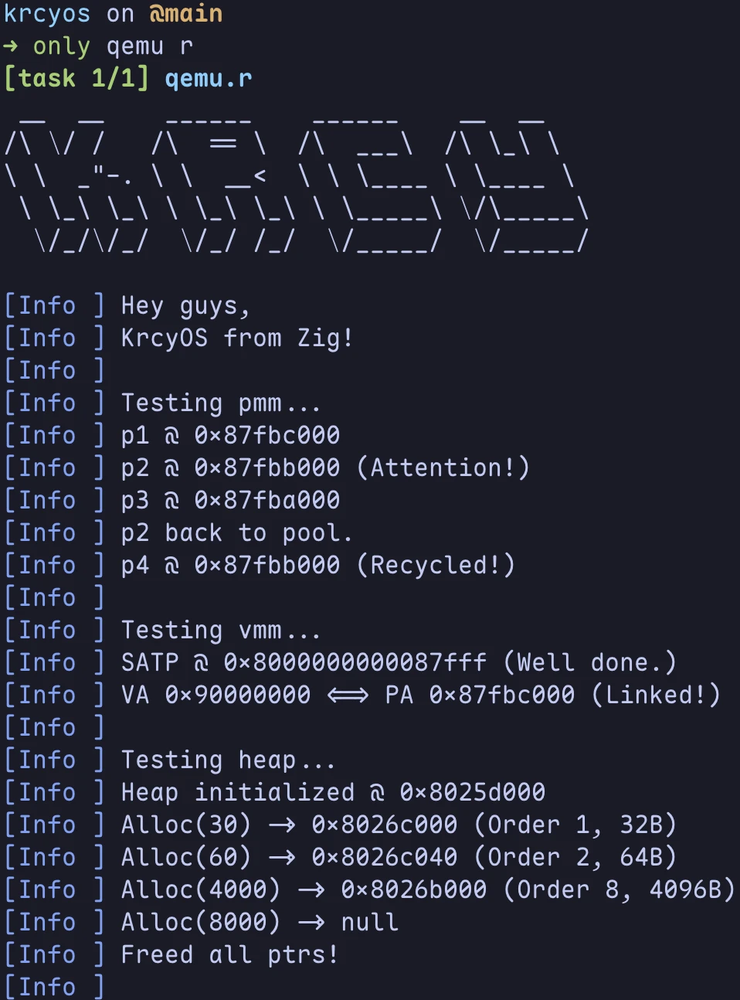
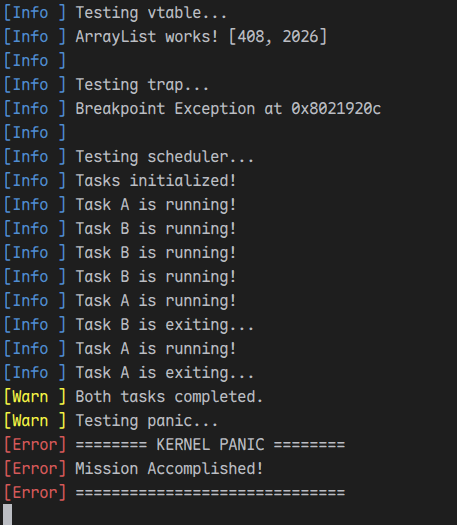

# 🌱 KrcyOS

A toy RISC-V kernel built with Zig for OS exploration.

The main repository is on [kercycode](https://code.kercy666.com/Kercy/krcyos).

Read only mirror exists on [github](https://github.com/KercyDing/krcyos.git).

---

<p align="left">
  
  &nbsp;
  
</p>

## Motivation

*Just for fun.*

## Prerequisites

- **[Zig](https://ziglang.org/download)** (pinned to `0.16.0`)
- **[QEMU](https://www.qemu.org/download)** (>=11.0.0, if you don't have a real board)
- **[Only](https://github.com/KercyDing/only)** (task runner if you like)

> Skill issue? Click [here](https://google.com/).

## Getting Started

### Clone
```bash
git clone https://code.kercy666.com/Kercy/krcyos.git
# if you prefer github:
# git clone https://github.com/KercyDing/krcyos.git
cd krcyos
# ...
```

### Run
Note that it is supervisor-test.
```bash
zig build run
# or:
# only qemu r
```

Build for real board:
```bash
zig build run -Dboard=real_board
# or:
# only real r
```

> Press `Ctrl+A` + `X` to exit qemu.

### More
For user-test:
```bash
zig build run -Dmode=user
# or:
# only qemu r user
```

Run unit tests:
```bash
zig build test
# or:
# only test
```

## Why not C/Rust?
No reason. Zig worth.
